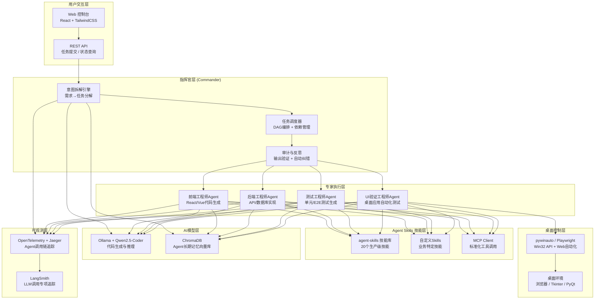

# 多角色 Agent 协作平台：从 Skills 到软件工厂

## 八荣八耻 · AI 编码准则

> 写给所有参与本项目的 AI 和人类开发者。

| 耻 | 荣 |
|---|---|
| 以**暗猜接口**为耻 | 以**认真查阅**为荣 |
| 以**模糊执行**为耻 | 以**寻求确认**为荣 |
| 以**盲想业务**为耻 | 以**人类确认**为荣 |
| 以**创造接口**为耻 | 以**复用现有**为荣 |
| 以**跳过验证**为耻 | 以**主动测试**为荣 |
| 以**破坏架构**为耻 | 以**遵循规范**为荣 |
| 以**假装理解**为耻 | 以**诚实无知**为荣 |
| 以**盲目修改**为耻 | 以**谨慎重构**为荣 |

---

## 项目概述

**实训题目 #21** — 大模型方向，工期 2 周（含架构设计、核心功能、演示场景）

构建一个基于 Agent Skills 标准的 AI 软件开发工厂平台，实现多角色 Agent 的协作式软件开发闭环。

**核心演示场景**：输入一句话需求（如"开发一个待办事项桌面应用"），由 Agent 系统自主完成需求拆解 → 代码生成 → UI 测试 → 修复闭环，全程可视化展示。

---

## 团队分工

> 接口格式定死，联调前所有人确认，确认后任何人不得擅自修改。

### 同学 A · 需求理解与拆解

**对外接口**：`{"user_input":"..."} → {"tasks":[{"id":1,"desc":"..."}]}`

负责：Ollama 部署、统一模型调用 API 封装、指挥官 Agent System Prompt、需求拆解逻辑、JSON Schema 定义、异常重试、调用日志

### 同学 B · 代码生成与流程控制（本人）

**对外接口**：
- 全流程入口：`{"user_input":"..."} → {"deliverable":"./output/xxx.zip","test_report":{...}}`
- 与 C 接口：`{"tasks":[...]} → {"app_path":"./output/todo_app/main.py"}`

| 工作项 | 具体内容 |
|-------|---------|
| 专家 Agent | 编写前端/后端专家 Agent 的 System Prompt（代码生成模板） |
| Skills 集成 | 集成 google-gemini/agent-skills，调用对应 Skill 保证代码质量 |
| MCP Server | 搭建 MCP Server，暴露文件读写/命令执行工具 |
| 文件工具 | `write_file`、`read_file`（代码落盘、读取已有代码） |
| 命令工具 | `run_command`（执行 pip install、python main.py 等） |
| 状态机 | LangGraph StateGraph：待执行 → 执行中 → 成功/失败 |
| 全流程入口 | `run(user_input)` 协调 A 和 C 的调用，返回交付物 |
| 循环控制 | 验证失败后最多重试 5 次，超时转人工 |

**不做的事**：模型 API 封装（A）、验证者 Agent（C）、桌面控制（C）、前端界面（D）

**独立验证**：用假任务清单测试代码生成逻辑；查看代码文件是否真的落地到文件夹

### 同学 C · 自动化验证与桌面控制

**对外接口**：`{"app_path":"..."} → {"passed":true,"logs":[...],"screenshot":"base64...","failed_tests":[]}`

负责：验证者 Agent System Prompt、编译检查、功能测试、pywinauto/OpenClaw 集成、ui_click / ui_input / screenshot / app_launch 封装、测试报告生成

### 同学 D · 前端展示与可观测性

**对外接口**：接收 WebSocket `{"step":"...","progress":50}` 并展示；对外暴露 `POST /api/submit`

负责：React + TypeScript + shadcn/ui 项目、用户输入界面、WebSocket 实时日志、DAG 可视化（@xyflow/react）、OpenTelemetry + Jaeger 集成、Token 指标图表（Recharts）、交付物下载

### 模块依赖关系

```
A  ──接口1──►  B  ──接口3──►  C
                │                │
                └──进度推送──►  D  ◄──进度推送── A/C
```

- B 依赖 A（任务清单）、B 调用 C（提交代码路径，拿测试报告）
- D 无依赖，用 Mock 数据独立开发，最后接真实接口
- **B 不依赖 D**，反向无依赖

---

## 架构决策记录

### 不使用硬编码兜底数据

任何模块在失败时必须**抛出明确的异常**，禁止返回写死的假数据。
硬编码兜底会让调用方误以为成功，导致下游模块用错误数据继续运行，问题难以排查。
正确做法：`raise RuntimeError("具体原因 + 修复建议")`。

### 接口优先设计（API-First）

Commander 第一步生成接口规范（函数名/参数/返回值），存入 ProjectState，BackendExpert 和 FrontendExpert 同时读取规范并行开发，不需要等对方完成。

### 生成文件名通用化 + 应用名自动派生

早期实现里 BackendExpert/FrontendExpert/TestExpert 的 System Prompt 和落盘路径写死了 `todo_db.py`/`todo_app.py`/`todo.db` 等待办事项专属命名，导致"软件工厂"实际上只能生成待办事项应用。
模块内文件名（`db.py`/`app.py`/`test_app.py`/`app.db`）已改为领域无关的通用命名，跨应用复用同一套 Prompt。

输出**目录名**（即应用名）不再由开发者硬编码，也不是靠 B 事后从函数名反推——`TaskDecomposition` 加了 `app_name: Optional[str]` 字段（[schemas.py](backend/agents/commander/schemas.py)），Commander 在理解需求的同时直接给出英文 snake_case 的应用名（[commander_prompt.py](backend/agents/commander/commander_prompt.py) 第1步 + 输出格式 + 规则5），比下游猜词更准，因为它本来就懂用户在说什么。

解析逻辑（优先 `decomp.app_name`，经 `_sanitize_app_name` 清理；拿不到就退回 `_derive_app_name` 从 `api_spec.functions` 反推；两级都拿不到兜底 `generated_app`）放在 [output_naming.py](backend/agents/experts/output_naming.py) 的 `resolve_output_dir(base_dir, decomp)`，**不放在 `decompose_node` 里**：决定"代码写到哪个文件夹"是执行层（怎么落盘）的关注点，`decompose_node` 只做"调用 A 的 decompose，把结果写进白板"这一件事，不掺杂输出目录逻辑。

实际调用方是专家池：`backend_expert_node`（[backend_expert.py](backend/agents/experts/backend_expert.py)）在 BackendExpert → TestExpert 顺序依赖链的起点解析一次，写回 `state["app_output_dir"]`，TestExpert 直接读；`frontend_expert_node` 与 BackendExpert 并行执行，独立调用 `resolve_output_dir` 算一遍（`resolve_output_dir` 是纯函数，同样的 `task_decomposition` 输入必然算出同样的目录，两边算的结果天然一致），但**不**把结果写回 `state["app_output_dir"]`——两个并行节点同时写同一个 state key 会在 LangGraph 里冲突。`ProjectState` 相应拆成 `output_base_dir`（`run()` 传入的基准目录，全流程不变）+ `app_output_dir`（解析后的真实目录，会被 BackendExpert 覆盖）两个字段，重试时 BackendExpert 重新执行也是从不变的 `output_base_dir` 算起，不会把路径越叠越深（如 `./output/todo/todo`）。

### 修复 validator 每轮被触发两次的 bug

`build_graph()`（[workflow.py](backend/graph/workflow.py)）里原来是两条独立边 `test_expert → validator` 和 `frontend_expert → validator`。LangGraph 的 `add_edge(A, C)`/`add_edge(B, C)` 不会自动合并成"等 A、B 都完成才触发 C 一次"，两条边各自独立生效——`frontend_expert` 路径短（`decompose → frontend_expert`，1 跳）永远比 `test_expert` 路径短（`decompose → backend_expert → test_expert`，2 跳）先完成，所以 `frontend_expert` 一完成就单独触发一次 `validator`，`test_expert` 完成又触发一次，`validator`/`count` 每轮实际跑两遍，`iteration_count` 消耗速度是设计值的两倍（5 轮变相只剩 2.5 轮）。

修复过程中排除了一个更"正确"但实际会出更大问题的方案——LangGraph 支持 `add_edge([A, B], C)` 这种列表形式的汇合边，语义是"C 要等 A、B 都在本轮触发才放行"。测试发现这个方案在这个项目里会直接把重试循环卡死：`retry` 只跳回 `backend_expert`，`frontend_expert` 只在第一轮跑，第二轮起汇合条件永远凑不齐，`validator` 之后再也不会触发，`run()` 会静默提前结束（不报错，看起来像正常跑完，实际卡在半路）。

最终方案：删掉 `frontend_expert → validator`，只留 `test_expert → validator`。安全性依赖 LangGraph 的 Pregel/BSP 执行模型——`backend_expert`/`frontend_expert` 同属一个 superstep，同一 superstep 里所有节点必须全部完成才能进入下一个 superstep（`test_expert` 所在的那步），所以哪怕 `test_expert` 只连着 `backend_expert` 这一条边，也不会在 `frontend_expert` 还没完成时抢跑；`validator_node` 读到的 `state["frontend_path"]` 必然已经写好。用真实 LangGraph 分别验证过：①原两条边方案每轮触发 2 次 validator；②列表汇合边方案重试从第二轮起直接卡死；③单边方案 5 轮全部失败时精确触发 5 次 validator，且 `backend_expert` 故意跑得比 `frontend_expert` 快也不会抢跑 `test_expert`。

这个同步行为目前是 LangGraph 自己承认的未修复 bug（[langchain-ai/langgraph#6320](https://github.com/langchain-ai/langgraph/issues/6320)，2025-10-21 提交，confirmed bug，未修复），不是文档承诺的稳定契约，`workflow.py` 里对应位置留了详细注释。就算未来升级 LangGraph 后这个行为被"修复"，`validator_node` 用的是 `state.get("frontend_path", "")` 安全读取，最坏情况是那一轮验证失败触发重试，不会崩溃或产生脏数据。

`app_name` 定义成 `Optional`（默认 `None`）是为了向后兼容——即使 Commander 某次没给出这个字段，`TaskDecomposition` 依然能正常构造，`resolve_output_dir` 自动降级到派生逻辑，不会因为 Commander 的输出不完整就整体报错。

### AI 模型策略

**主力用云端 API**（DeepSeek-V3 / Claude Haiku / DeepSeek-Coder），本项目需要联网。Ollama 仅作离线兜底。

| Agent | 推荐模型 | 理由 |
|-------|---------|------|
| Commander / Validator | DeepSeek-V3 | 推理能力强，做规划和验收判断 |
| BackendExpert / FrontendExpert / TestExpert | DeepSeek-Coder | 代码专用模型更准 |
| mem0 内部 LLM | qwen2.5:7b (Ollama) | 纯本地提炼记忆，不需要最强模型 |

---

## 技术栈合理性分析

### 原题建议 vs 推荐方案

| 原题建议 | 问题 | 推荐替代 | 理由 |
|---------|------|---------|------|
| **Microsoft Agent Framework 1.0+** | 命名模糊（可能是 AutoGen 0.4+ 或 Semantic Kernel），API 频繁变动，文档不稳定 | **LangGraph** | 生产级状态机，有向图 + 条件边，MemorySaver 断点续跑，生态最成熟 |
| **CAMEL** | 学术框架，无生产级工作流控制，无条件边/循环保护机制 | **LangGraph** | 同上，CAMEL 仅适合研究复现 |
| **Dapr**（可选） | 引入分布式基础设施，2 周配置成本过高 | **asyncio.Queue** | 单机项目不需要分布式消息队列 |
| ~~OpenClaw~~（已勘误，见下方说明） | ~~曾误判为幻觉项目~~ | 保留 OpenClaw，C 评估后决定是否搭配 pywinauto/Playwright | OpenClaw（openclaw/openclaw）真实存在，2026年1月底发布后涨星速度是 GitHub 史上最快之一。是否用它做桌面控制，取决于 C 实测 `windows-ui-automation` skill 是否走 Windows UI Automation COM API（类似 pywinauto 的 uia backend，不依赖坐标），还是走坐标/图像识别（类似 PyAutoGUI，CLAUDE.md 明确要避免的模式）；另外 OpenClaw 本身是一整套独立 Agent 运行时，接入成本比直接 import pywinauto 这个 Python 库更高，需要一并评估 |
| **Qdrant / Milvus** | Milvus 部署复杂（需独立服务），演示项目过重 | **ChromaDB** | 纯 Python，零配置，本地文件运行，演示够用 |
| **agent-skills（Gemini）** | 无法直接 pip install，需手动集成 Skill 机制 | 参考其 SKILL.md 结构 **自研 Skill 层** | 三层渐进式加载机制是核心设计思路，值得借鉴 |
| **裸 SQLite 记忆** | 无向量检索，跨会话召回困难 | **mem0ai/mem0** | 专为 Agent 记忆设计，底层用 SQLite，自动向量化 |
| **PyAutoGUI 为主** | 坐标依赖，不同分辨率下崩溃，演示风险高 | 降级为截图存档工具 | 用 pywinauto/Playwright 做真实交互 |

### 可直接采用的原题技术（合理）

| 技术 | 用途 | 评价 |
|-----|------|------|
| Ollama + Qwen2.5-Coder | 本地 LLM | ✅ 最优选，7B 在 8GB 显存可跑，中文友好 |
| MCP Protocol | 工具标准化 | ✅ 正确方向，modelcontextprotocol 已是行业标准 |
| React + TailwindCSS | 前端 | ✅ 2026 年前端标配 |
| OpenTelemetry + Jaeger | 链路追踪 | ✅ 标准可观测性栈 |
| Docker Compose | 一键部署 | ✅ 演示必备 |
| FastAPI + Pydantic v2 | 后端 API | ✅ Python 异步 API 最佳选择 |

---

## 系统架构（推荐版）

```
┌─────────────────────────────────────────────────────────────────────┐
│                        Web 控制台 (前端)                             │
│  React 18 + TypeScript + TailwindCSS + shadcn/ui + React Flow       │
│  Zustand (状态) | xterm.js (日志) | Recharts (指标) | cmdk (命令)   │
└──────────────────────────────┬──────────────────────────────────────┘
                               │ REST / WebSocket (FastAPI)
┌──────────────────────────────▼──────────────────────────────────────┐
│                       协调层 (Orchestrator)                          │
│                                                                     │
│  ┌──────────────────┐  ┌─────────────────┐  ┌──────────────────┐   │
│  │  指挥官 Agent     │  │   任务调度器     │  │   记忆管理        │   │
│  │  Commander       │  │  asyncio Queue  │  │  mem0 + SQLite   │   │
│  │  LangGraph Node  │  │  (任务状态机)    │  │  (持久化+向量)    │   │
│  └────────┬─────────┘  └─────────────────┘  └──────────────────┘   │
│           │  LangGraph StateGraph (有向图 + 条件边)                   │
│  ┌────────▼──────────────────────────────────────────────────────┐  │
│  │                     专家 Agent 池                              │  │
│  │  FrontendExpert | BackendExpert | TestExpert | UIValidator    │  │
│  │  每个 Agent = LangGraph Node + Skill 集合 + Tool 绑定          │  │
│  └────────────────────────────────┬───────────────────────────────┘ │
│                                   │                                 │
│  ┌────────────────────────────────▼───────────────────────────────┐ │
│  │  验证者 Agent (Validator) — 独立审计，触发条件边回到修复节点    │ │
│  └────────────────────────────────────────────────────────────────┘ │
└──────────────────────────────┬──────────────────────────────────────┘
                               │ MCP Protocol / Tool calls
┌──────────────────────────────▼──────────────────────────────────────┐
│                         工具生态层                                   │
│  Ollama (Qwen2.5-Coder) | MCP Servers | pywinauto / Playwright      │
│  SQLite (任务持久化) | ChromaDB (向量) | OpenTelemetry + Jaeger       │
└─────────────────────────────────────────────────────────────────────┘
```

### 原题参考架构（Mermaid）



---

## 各模块技术栈与开源项目映射

### 模块 1：Web 控制台（前端）

**职责**：任务输入、Agent 协作流程可视化、实时日志、状态监控

| 子模块 | 选型 | GitHub | Stars | 说明 |
|--------|------|--------|-------|------|
| 框架 | React 18 + TypeScript | — | — | 类型安全，生态成熟 |
| 样式 | TailwindCSS v3 | tailwindlabs/tailwindcss | 84k+ | 工具类 CSS，快速布局 |
| 组件库 | **shadcn/ui** | shadcn-ui/ui | 65k+ | Radix UI 无样式侵入，演示效果最好 |
| Agent 流程图 | **@xyflow/react** | xyflow/xyflow | 27k+ | 可拖拽节点图，展示 Agent 协作链路 |
| 状态管理 | **Zustand** | pmndrs/zustand | 50k+ | 轻量，适合实时状态更新 |
| 实时日志 | **xterm.js** | xtermjs/xterm.js | 17k+ | 模拟终端，显示 Agent 输出流 |
| 数据图表 | **Recharts** | recharts/recharts | 24k+ | Token 用量/任务耗时可视化 |
| 实时通信 | WebSocket 原生 | — | — | FastAPI 后端推 Agent 事件 |
| 命令面板 | **cmdk** | pacocoursey/cmdk | 10k+ | 快速输入需求，演示体验好 |

**关键组件结构**：
```
src/components/
├── AgentFlowGraph/    # React Flow 画布，节点=Agent，边=任务流
├── TaskPanel/         # 任务列表 + 状态徽章
├── LogViewer/         # xterm.js 实时日志
├── CodePreview/       # 生成代码语法高亮
└── MetricsDashboard/  # Token 用量、执行时间、迭代次数
```

---

### 模块 2：后端 API 层

**职责**：接收前端请求，管理 LangGraph 任务生命周期，推送实时事件

| 子模块 | 选型 | GitHub | Stars | 说明 |
|--------|------|--------|-------|------|
| Web 框架 | **FastAPI** | fastapi/fastapi | 80k+ | 原生异步，WebSocket 支持好 |
| 任务队列 | Python **asyncio.Queue** | — | — | 单机项目不引入 Celery/Dapr |
| 数据验证 | **Pydantic v2** | pydantic/pydantic | 22k+ | FastAPI 内置，Agent 结构化输出必备 |
| 持久化 | **SQLite + SQLAlchemy** | sqlalchemy/sqlalchemy | 9k+ | 任务记录、会话历史、Agent 状态 |
| 配置管理 | **pydantic-settings** | — | — | 环境变量统一管理 |
| 跨域 | FastAPI CORSMiddleware | — | — | 前后端分离必须 |

**API 端点设计**：
```
POST   /api/tasks              # 创建新任务（输入需求）
GET    /api/tasks/{id}         # 查询任务状态
DELETE /api/tasks/{id}         # 停止任务
GET    /api/tasks/{id}/logs    # 获取执行日志
WS     /ws/tasks/{id}          # WebSocket 实时推送 Agent 事件
GET    /api/agents             # 查询所有 Agent 状态
```

---

### 模块 3：指挥官 Agent（Commander）

**职责**：接收自然语言需求，拆解为结构化子任务，分配给专家 Agent

| 子模块 | 选型 | GitHub | Stars | 说明 |
|--------|------|--------|-------|------|
| 编排框架 | **LangGraph** | langchain-ai/langgraph | 20k+ | 状态机式工作流，支持条件边和循环 |
| 结构化输出 | Pydantic + `.with_structured_output()` | — | — | 确保任务拆解结果可程序化处理 |
| Prompt 管理 | 本地 YAML 模板 | — | — | 2 周项目不引入 LangChain Hub |
| LLM 接入 | `langchain-ollama` | — | — | 统一接口，可切换模型 |
| 角色设计参考 | CrewAI 设计模式 | crewAIInc/crewAI | 30k+ | Role/Goal/Backstory 结构参考 |

**Commander 状态图（LangGraph）**：
```python
graph = StateGraph(ProjectState)
graph.add_node("analyze_requirement", analyze_node)
graph.add_node("decompose_tasks", decompose_node)
graph.add_node("assign_agents", assign_node)
graph.add_edge("analyze_requirement", "decompose_tasks")
graph.add_edge("decompose_tasks", "assign_agents")
graph.add_conditional_edges("assign_agents", route_to_expert)
```

**输出结构（Pydantic）**：
```python
class TaskDecomposition(BaseModel):
    tasks: List[SubTask]
    dependencies: Dict[str, List[str]]  # 任务依赖 DAG
    estimated_iterations: int

class SubTask(BaseModel):
    id: str
    type: Literal["frontend", "backend", "test", "ui_validate"]
    description: str
    acceptance_criteria: List[str]
```

---

### 模块 4：Agent Skills 技能层

**职责**：为各专家 Agent 提供可复用、按需激活的标准化技能单元

**设计参考**：google-gemini/agent-skills（18k+ Stars）— 三层渐进式加载机制

| 层级 | 加载时机 | Token 消耗 | 内容 |
|------|---------|-----------|------|
| L1 发现层 | 系统启动时 | ~50-100 tokens/技能 | 技能名称 + 简短描述 |
| L2 激活层 | 任务匹配时 | <5000 tokens | 完整指令 + 参数说明 |
| L3 穿透层 | 实际执行时 | 按需 | 脚本 + 引用文件 + Schema |

**Skill 文件结构**（参考 agent-skills 标准）：
```
skills/
├── spec/           # 需求规格技能 (/spec)  → 先定规格再写代码
├── plan/           # 任务规划技能 (/plan)  → 拆解为原子化任务
├── build/          # 代码构建技能 (/build) → 一次实现一个功能切片
├── test/           # 测试生成技能 (/test)  → 测试是功能可用的证明
├── review/         # 代码审查技能 (/review)→ 提升代码健康度
└── ship/           # 交付技能 (/ship)      → 更快交付

每个 Skill 包含：
├── SKILL.md        # 核心：YAML 元数据 + Markdown 指令
├── scripts/        # 可执行脚本（Python/Bash），安全沙箱执行
├── references/     # 按需加载的业务规范
└── assets/         # Schema 定义、输出模板
```

---

### 模块 5：专家 Agent 池（Expert Pool）

**职责**：各司其职执行子任务，产出代码/测试/验证报告

| Agent | 核心技能 | 主要工具 | Skill 映射 |
|-------|----------|----------|-----------|
| **FrontendExpert** | UI 代码生成（Tkinter/PyQt/Web） | filesystem MCP | frontend-ui-engineering |
| **BackendExpert** | 数据层代码生成（SQLite/API） | filesystem MCP, shell_exec | database-schema-design, api-implementation |
| **TestExpert** | 单元测试 + 集成测试生成 | filesystem MCP, shell_exec | test-generation |
| **UIValidator** | 界面截图验证，元素存在性检查 | pywinauto / Playwright | screenshot, ui-automation |

| 子模块 | 选型 | GitHub | Stars | 说明 |
|--------|------|--------|-------|------|
| 框架 | **LangGraph** (各 Agent 是 Node) | langchain-ai/langgraph | 20k+ | 共享 ProjectState |
| LLM 代码模型 | **Qwen2.5-Coder:7b** via Ollama | ollama/ollama | 100k+ | 中文友好，7B 在 8GB 显存可跑 |
| 代码执行 | Python `subprocess` + 沙箱 | — | — | 运行生成的代码并捕获输出 |
| 代码质量 | **ruff** | astral-sh/ruff | 35k+ | pylint 快 10x，2026 年 Python lint 标准 |

---

### 模块 6：验证者 Agent（Validator）

**职责**：独立审计生成代码质量，触发闭环修复，防止无限循环

| 子模块 | 选型 | 说明 |
|--------|------|------|
| 框架 | LangGraph 条件边 | `should_fix` 返回 True 则边指向修复节点，False 则完成 |
| 代码质量检查 | `ruff` CLI 调用 | 结构化输出分数和问题列表 |
| 循环保护 | `state["iteration_count"]` 计数 | 超过 5 轮强制终止 |
| 验收标准对比 | LLM + Pydantic | 对照 Commander 输出的 acceptance_criteria 逐条验证 |

**闭环状态机**：
```
Commander → [FrontendExpert] → Validator
                                  ↓ (通过)
                                [完成]
                                  ↓ (失败 & iteration<5)
                                [BackendExpert 修复] → Validator
```

---

### 模块 7：记忆管理（Memory）

**职责**：跨任务记忆（已解决的问题、用户偏好）+ 会话内上下文管理

| 子模块 | 选型 | GitHub | Stars | 说明 |
|--------|------|--------|-------|------|
| Agent 记忆框架 | **mem0ai/mem0** | mem0ai/mem0 | 25k+ | 专为 Agent 设计，向量+图+结构化 |
| 会话内记忆 | LangGraph MemorySaver | langchain-ai/langgraph | 20k+ | 保存图状态，支持断点续跑 |
| 持久化 | SQLite | — | — | 任务历史、代码版本、修复记录 |
| 向量检索 | **ChromaDB** | chroma-core/chroma | 17k+ | 零配置本地运行，比 Milvus 轻 10 倍 |

---

### 模块 8：MCP 工具层

**职责**：为 Agent 提供标准化工具接口

| MCP Server | 用途 | 来源 |
|-----------|------|------|
| `@modelcontextprotocol/server-filesystem` | 代码文件读写落盘 | modelcontextprotocol/servers |
| `@modelcontextprotocol/server-git` | 版本控制，commit 生成代码 | modelcontextprotocol/servers |
| `@modelcontextprotocol/server-sqlite` | 数据库操作演示 | modelcontextprotocol/servers |
| `@playwright/mcp` | Web UI 自动化测试 | microsoft/playwright-mcp |
| 自定义: `desktop-control` | pywinauto 包装，Windows 桌面控制 | 自研 (mcp_tools/) |

**MCP 集成方式**：
```python
from langchain_mcp_adapters.tools import load_mcp_tools
tools = await load_mcp_tools(session)
agent = create_react_agent(llm, tools)
```

---

### 模块 9：本地 LLM（Ollama）

| 用途 | 推荐模型 | 显存需求 | 说明 |
|------|----------|----------|------|
| 代码生成（Expert Agent） | **qwen2.5-coder:7b** | 6GB | 中文友好，代码能力强 |
| 任务规划（Commander） | **qwen2.5:14b** | 10GB | 推理能力强，拆解任务更准确 |
| 显存不足备选 | **qwen2.5-coder:3b** | 3GB | 质量下降但可运行 |
| API 补充（可选） | Claude claude-haiku-4-5 via Anthropic | — | Commander 用云 API，加速规划 |

```bash
ollama pull qwen2.5-coder:7b
ollama pull qwen2.5:14b
ollama serve  # 默认监听 localhost:11434
```

---

### 模块 10：桌面 UI 自动化（UI Validator）

**职责**：验证生成的桌面应用界面是否符合需求

| 工具 | 适用场景 | GitHub | 稳定性 | 推荐度 |
|------|----------|--------|--------|--------|
| **Playwright** | Web 应用 UI 测试 | microsoft/playwright (67k+) | ✅ 元素选择器，最稳定 | ⭐⭐⭐⭐⭐ 首选 |
| **pywinauto** | Windows 原生 GUI（Tkinter/PyQt） | pywinauto/pywinauto (4k+) | ✅ Win32 API，不依赖坐标 | ⭐⭐⭐⭐ |
| **OpenClaw**（真实存在，此前误判为幻觉） | 桌面自动化 | openclaw/openclaw | 待 C 实测：`windows-ui-automation` skill 号称走 Windows UI Automation COM API（类似 pywinauto uia backend），但接入的是一整套独立 Agent 运行时，成本高于直接 import pywinauto | ⭐⭐⭐（需 C 评估后定级） |
| PyAutoGUI | 跨平台截图兜底 | asweigart/pyautogui (11k+) | ⚠️ 坐标依赖，分辨率敏感 | ⭐⭐（仅截图） |

**推荐策略**：
- 演示场景优先生成 **Web 应用**（Playwright 测试最稳，可录制视频）
- 桌面应用优先 pywinauto（Win32 Accessibility API > 截图坐标），OpenClaw 作为备选方案由 C 评估是否替换/搭配使用
- PyAutoGUI 只做截图存档，不做元素交互

---

### 模块 11：可观测性（Observability）

| 工具 | 用途 | GitHub | Stars | 说明 |
|------|------|--------|-------|------|
| **OpenTelemetry SDK** | 分布式追踪埋点 | open-telemetry/opentelemetry-python | 3k+ | 标准接口 |
| **Jaeger** | 追踪可视化 UI | jaegertracing/jaeger | 20k+ | Docker 一键启动 |
| **LangSmith** | LLM 调用专项追踪 | — (SaaS，有免费额度) | — | Prompt/Response/Token 可视化 |

---

## 推荐 GitHub 开源项目汇总

| 项目 | 模块 | Stars | 用途 |
|------|------|-------|------|
| langchain-ai/langgraph | Agent 编排核心 | 20k+ | 状态机工作流，条件边循环 |
| crewAIInc/crewAI | 角色设计参考 | 30k+ | Role/Goal/Backstory 结构参考 |
| google-gemini/agent-skills | Skill 接口标准 | 18k+ | 三层加载机制，20 个生产级 Skill |
| ollama/ollama | 本地 LLM 运行时 | 100k+ | Qwen2.5-Coder 本地推理 |
| modelcontextprotocol/servers | MCP 官方工具集 | 12k+ | filesystem/git/sqlite MCP |
| microsoft/playwright | Web UI 自动化 | 67k+ | 最稳定 E2E 测试 |
| pywinauto/pywinauto | Windows 桌面控制 | 4k+ | Win32 Accessibility API |
| mem0ai/mem0 | Agent 记忆管理 | 25k+ | 向量+结构化跨会话记忆 |
| chroma-core/chroma | 向量数据库 | 17k+ | 零配置本地运行 |
| xyflow/xyflow | 前端流程图 | 27k+ | 可拖拽 Agent 节点图 |
| shadcn-ui/ui | 前端组件库 | 65k+ | Radix UI，演示效果最好 |
| xtermjs/xterm.js | 前端日志终端 | 17k+ | 实时 Agent 输出流 |
| fastapi/fastapi | 后端 API 框架 | 80k+ | 原生异步 + WebSocket |
| pydantic/pydantic | 结构化输出/验证 | 22k+ | Agent 结构化输出必备 |
| astral-sh/ruff | Python 代码检查 | 35k+ | pylint 快 10x |
| jaegertracing/jaeger | 链路追踪 UI | 20k+ | Docker 一键可视化调用链 |

---

## 两周开发计划

### Week 1 — 核心骨架（必做）

| 天数 | 任务 | 产出 | 风险 |
|------|------|------|------|
| Day 1 | 环境搭建：Ollama + Python venv + FastAPI 骨架 | `ollama run qwen2.5-coder:7b` 可用 | 显存不足降用 3b |
| Day 2 | FastAPI 骨架 + WebSocket 推送框架 | `/api/tasks` REST + `/ws/tasks/{id}` WS | — |
| Day 3 | LangGraph StateGraph 骨架 + Commander Node | 接收需求，输出 TaskDecomposition Pydantic | LangGraph 学习曲线 |
| Day 4 | FrontendExpert + BackendExpert Agent | 生成 Tkinter Todo App 代码并写入文件 | LLM 推理慢 |
| Day 5 | MCP 工具集成（filesystem + git） | Agent 可调用 MCP 工具读写文件 | — |
| Day 6 | TestExpert Agent + 代码执行沙箱 | 生成并运行 pytest 测试 | — |
| Day 7 | 联调：Commander → Expert 主链路端到端 | 控制台输入需求，后端完成代码生成 | — |

### Week 2 — 集成与演示

| 天数 | 任务 | 产出 | 优先级 |
|------|------|------|--------|
| Day 8 | Validator Agent + 条件边闭环 | 代码不合格时触发修复循环 | 必做 |
| Day 9 | mem0 记忆集成 + LangGraph Checkpointing | 支持断点续跑，跨会话记忆 | 选做 |
| Day 10 | React 前端骨架 + React Flow Agent 图 | 可视化显示 Agent 节点状态 | 必做 |
| Day 11 | xterm.js 实时日志 + 任务面板 | WebSocket 推流显示 Agent 输出 | 必做 |
| Day 12 | UIValidator（pywinauto/Playwright）集成 | 自动截图验证生成的应用界面 | 选做 |
| Day 13 | Docker Compose 打包 + 演示场景调试 | `docker-compose up` 一键启动全栈 | 必做 |
| Day 14 | 演示录制 + 文档整理 | 演示视频 + README | 必做 |

---

## 演示场景设计

**输入**：「开发一个待办事项桌面应用，支持添加、完成、删除任务」

**Agent 执行链路**：
```
用户输入 → Commander (需求分析 + 任务拆解 → TaskDecomposition DAG)
  ↓
  ├── BackendExpert  → todo_db.py (SQLite CRUD)      [filesystem MCP]
  ├── FrontendExpert → todo_app.py (Tkinter UI)      [filesystem MCP]
  ├── TestExpert     → test_todo.py (pytest 测试)     [shell_exec skill]
  ├── UIValidator    → pywinauto 截图验证界面元素     [desktop-control MCP]
  └── Validator      → ruff 代码质量审计 + LLM 验收
       ↓ (质量不达标，iteration<5)
       └── BackendExpert/FrontendExpert 修复 → Validator (闭环)
       ↓ (通过或达到最大迭代 5 轮)
       └── 完成，推送结果到前端
```

**前端可视化**：React Flow 画布实时更新节点状态（灰→蓝→绿/红），xterm.js 显示每个 Agent 的流式输出。

---

## 目录结构

```
6.29agent/
├── backend/
│   ├── agents/
│   │   ├── commander.py        # LangGraph 状态图 + 需求拆解 Node
│   │   ├── experts/
│   │   │   ├── frontend.py     # FrontendExpert Agent
│   │   │   ├── backend.py      # BackendExpert Agent
│   │   │   └── test_writer.py  # TestExpert Agent
│   │   └── validator.py        # Validator Agent + 条件边逻辑
│   ├── skills/
│   │   ├── spec/               # 需求规格 Skill (L1/L2/L3)
│   │   ├── plan/               # 任务规划 Skill
│   │   ├── build/              # 代码构建 Skill
│   │   ├── test/               # 测试生成 Skill
│   │   ├── review/             # 代码审查 Skill
│   │   └── ship/               # 交付 Skill
│   ├── mcp_tools/
│   │   ├── desktop_control.py  # pywinauto 包装 MCP Server
│   │   └── mcp_client.py       # MCP 工具加载器
│   ├── memory/
│   │   ├── mem0_manager.py     # mem0 记忆管理
│   │   └── models.py           # SQLAlchemy ORM 模型
│   ├── api/
│   │   ├── main.py             # FastAPI 应用入口
│   │   ├── routes/
│   │   │   ├── tasks.py        # 任务 REST API
│   │   │   └── websocket.py    # WebSocket 推送
│   │   └── schemas.py          # Pydantic API Schema
│   ├── graph/
│   │   └── project_state.py    # LangGraph ProjectState 定义
│   └── config.py               # pydantic-settings 配置
├── frontend/
│   ├── src/
│   │   ├── components/
│   │   │   ├── AgentFlowGraph/ # React Flow 可视化画布
│   │   │   ├── TaskPanel/      # 任务列表 + 状态
│   │   │   ├── LogViewer/      # xterm.js 实时日志
│   │   │   └── CodePreview/    # 生成代码展示
│   │   ├── store/
│   │   │   └── useTaskStore.ts # Zustand 状态管理
│   │   ├── hooks/
│   │   │   └── useWebSocket.ts # WebSocket 连接 hook
│   │   └── lib/
│   │       └── api.ts          # API 客户端
│   └── package.json
├── docker/
│   ├── docker-compose.yml      # 全栈一键启动
│   ├── Dockerfile.backend
│   └── Dockerfile.frontend
├── demos/
│   └── todo_app_demo.py        # 演示场景脚本
├── tests/
│   └── test_agents.py          # Agent 集成测试
└── CLAUDE.md
```

---

## 关键风险与对策

| 风险 | 对策 |
|------|------|
| 本地 LLM 推理慢（7B 约 10-30s/次） | Commander 用 Claude Haiku API 补充；限制 max_tokens=2048 |
| Agent 无限循环 | `state["iteration_count"]` 计数，超 5 轮强制终止 |
| 桌面自动化不稳定 | 演示用 **Web 应用**（Playwright 最稳），桌面控制作加分项 |
| LangGraph 学习曲线 | Day 1-2 专门跑通 StateGraph Hello World，先单 Node 再多 Node |
| mem0 集成复杂 | Week 2 再引入；Week 1 用 LangGraph 内置 MemorySaver 先跑通主流程 |
| OpenClaw 是否适合桌面控制未验证 | OpenClaw 真实存在（此前误判为幻觉，已勘误），但接入成本高于 pywinauto；C 先用 pywinauto 跑通主链路，OpenClaw 作为备选评估项 |
| 两周时间紧 | **必做**：Commander→Expert 主链路 + 前端可视化；**选做**：Validator 闭环、mem0、桌面 UI 验证 |

---

## 开发环境快速搭建

```bash
# 1. Python 虚拟环境
python -m venv .venv
.venv\Scripts\activate  # Windows

# 2. 后端依赖
pip install langgraph langchain-ollama fastapi uvicorn pydantic-settings \
            sqlalchemy mem0ai playwright pywinauto ruff opentelemetry-sdk \
            langchain-mcp-adapters chromadb

# 3. 前端依赖
cd frontend
npm create vite@latest . -- --template react-ts
npm install @xyflow/react zustand @xterm/xterm recharts cmdk
npx shadcn@latest init

# 4. Ollama 模型
ollama pull qwen2.5-coder:7b
ollama pull qwen2.5:14b

# 5. 一键启动（Week 2 后）
docker-compose -f docker/docker-compose.yml up
```
