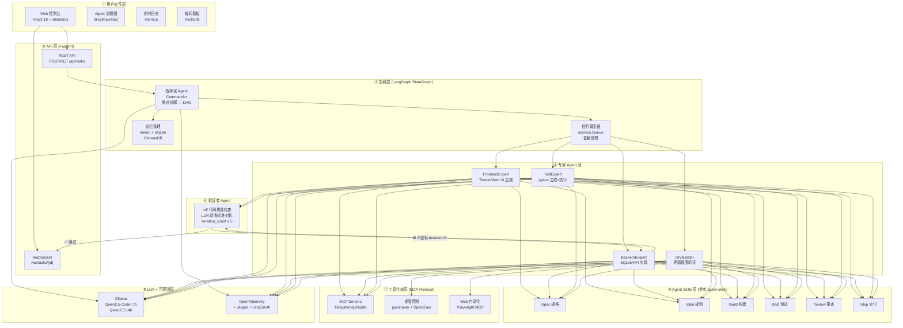

# 系统架构图

> 状态：待审定（需求分析阶段）
> 更新日期：2026-06-30

## 架构概述

系统采用三层八模块架构：
- **用户交互层**：React 18 Web 控制台，可视化 Agent 协作流程
- **协调层**：LangGraph 有向图调度，指挥官 Agent 拆解任务分发给专家 Agent 池
- **工具生态层**：MCP 工具 + 本地 LLM + 桌面控制 + 向量记忆 + 可观测基础设施

核心数据流：`用户输入 → Commander 拆解 → 专家 Agent 并发执行 → Validator 审计 → 条件边闭环（max 5轮）→ WebSocket 推送前端`

---

## Mermaid 架构图



---

## 分层说明

### 层 1 — 用户交互层

| 组件 | 技术 | 作用 |
|------|------|------|
| Web 控制台 | React 18 + TypeScript | SPA 主框架 |
| Agent 流程图 | @xyflow/react | 实时展示 Agent 节点状态（灰→蓝→绿/红） |
| 实时日志 | xterm.js | WebSocket 流式接收 Agent 输出 |
| 指标看板 | Recharts | Token 用量、执行时间、迭代次数 |
| 组件库 | shadcn/ui | Radix UI 无样式侵入 |
| 状态管理 | Zustand | WebSocket 实时状态 |
| 命令面板 | cmdk | 快速输入需求 |

### 层 2 — API 层

FastAPI 同时提供：
- `REST API`：任务 CRUD、状态查询
- `WebSocket`：Server → Client 单向推送 Agent 事件流（每个 Agent 步骤推一条消息）

### 层 3 — 协调层

核心是 `LangGraph StateGraph`，共享 `ProjectState`：

```python
class ProjectState(TypedDict):
    requirement: str
    task_decomposition: TaskDecomposition
    current_agent: str
    generated_files: Dict[str, str]
    iteration_count: int
    validation_result: Optional[ValidationResult]
    messages: List[BaseMessage]
```

### 层 4 — 专家 Agent 池

每个专家 Agent 是 LangGraph 的一个 Node，共享 `ProjectState`，独立上下文窗口（避免上下文稀释）。

### 层 5 — Skills 层

三层渐进式加载（参考 google-gemini/agent-skills）：
- `L1` 发现层：系统启动加载，~50-100 tokens/技能
- `L2` 激活层：任务匹配时加载，<5000 tokens
- `L3` 穿透层：执行时加载脚本和引用文件

### 层 6 — 验证者 Agent

```python
# 条件边函数
def should_continue(state: ProjectState) -> Literal["fix", "done"]:
    if state["validation_result"].passed:
        return "done"
    if state["iteration_count"] >= 5:
        return "done"  # 强制终止，返回最优结果
    return "fix"
```

### 层 7 — 工具生态层（MCP）

| MCP Server | 地址 | 用途 |
|-----------|------|------|
| filesystem | modelcontextprotocol/servers | 代码文件读写 |
| git | modelcontextprotocol/servers | 版本控制 |
| sqlite | modelcontextprotocol/servers | 数据库操作 |
| playwright | @playwright/mcp | Web UI 自动化 |
| desktop-control | 自研 | pywinauto/OpenClaw 包装 |

### 层 8 — LLM + 可观测

- **Ollama**：Commander 用 Qwen2.5:14b，Expert 用 Qwen2.5-Coder:7b
- **OpenTelemetry + Jaeger**：每个 Agent 调用生成 Span，可视化调用链
- **LangSmith**：Prompt/Response/Token 追踪，调试 LLM 行为

---

## 核心演示场景数据流

```
输入: "开发一个待办事项应用"
  ↓
Commander (Qwen2.5:14b)
  → 输出 TaskDecomposition {tasks: [backend, frontend, test, ui_validate]}
  ↓
BackendExpert → todo_db.py (SQLite CRUD)     [filesystem MCP]
FrontendExpert → todo_app.py (Tkinter/Web)  [filesystem MCP]
TestExpert → test_todo.py (pytest)           [shell_exec]
UIValidator → 截图 + 元素检测               [pywinauto/Playwright]
  ↓
Validator (ruff + LLM)
  → 验收标准对比 → 通过 ✅
  → 不通过 ❌ → iteration++ → 返回修复节点
  ↓
WebSocket 推送 → xterm.js 实时显示 + React Flow 节点变绿
```
