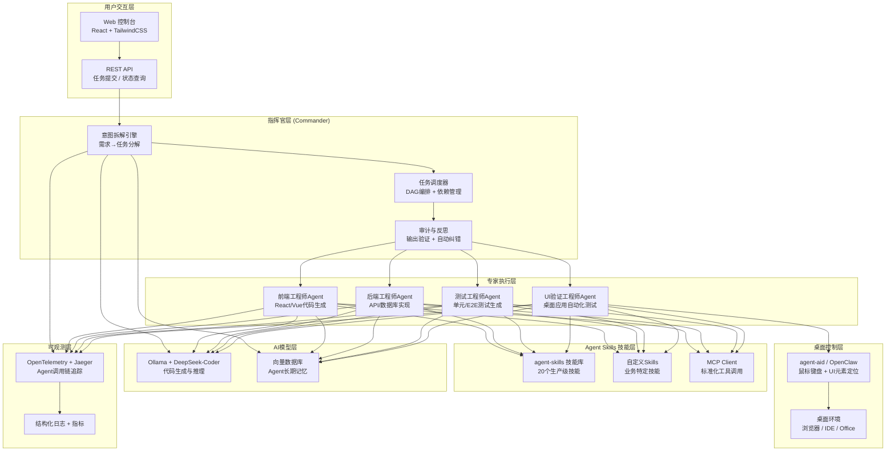

## 第一部分：选题填表

| **类别** | **编号** | **题目** | **限报** | **要求** | **需求概述** | **担任角色** | **建议方案** | **建议语言** | **成果形式** |
|:---:|:---:|:---|:---:|:---:|:---|:---|:---|:---:|:---|
| **大模型** | 21 | **多角色Agent协作平台：从Skills到软件工厂** | 4 | | 构建一个基于Agent Skills标准的AI软件开发工厂平台，实现多角色Agent的协作式软件开发闭环。平台采用“指挥官-专家-验证者”三层多智能体架构，集成本地LLM（Ollama/DeepSeek）和MCP工具生态，实现需求理解、任务拆解、代码生成、UI测试、桌面集成应用自动化执行的全流程自主开发。核心功能：指挥官Agent进行需求拆解与任务规划；专家Agent包括前端工程师、后端工程师、测试工程师和UI验证工程师，按角色完成模块开发与自动化执行桌面软件的测试验证；验证者Agent对输出进行独立审计，形成“写代码→测试→反馈→修复”闭环。平台提供Web控制台，可视化展示Agent协作流程和开发生命周期进度。目标：在2周内实现一个可演示的软件开发场景，如“开发一个待办事项桌面应用”完全由Agent自主完成。 | 架构师，后端，算法，前端 | **核心框架**：Microsoft Agent Framework 1.0+ 或 CAMEL（多智能体编排）+ Dapr（可选），**Agent Skills**：参考Gemini团队开源的agent-skills项目（20个生产级技能，覆盖软件开发全生命周期），**LLM**：Ollama + DeepSeek-Coder/Qwen2.5-Coder，**工具集成**：MCP Client + Agent Skills SDK + 自定义Scripts，**桌面控制**：集成OpenClaw或agent-aid实现UI自动化测试和桌面应用操作，**前端**：React/Vue + TailwindCSS，**数据存储**：SQLite（会话/任务/记忆）+ Qdrant/Milvus（可选Agent记忆向量存储），**可观测性**：OpenTelemetry + Jaeger追踪Agent协作全链路，**部署**：Docker Compose一键启动。 | Python + TypeScript | 系统、开发报告 |

## 第二部分：完整设计方案与开发思路（2周版）

### 一、选题背景与价值定位

2026年是Agentic AI全面爆发的关键一年。从技术生态来看，多智能体系统（MAS）正经历从“演示可跑”到“生产可用”的质变——如Factory的Missions系统在16.5小时内自主完成了一个Slack克隆应用，生成3.8万行代码且测试覆盖率达89.25%；Cursor构建的“software factory”让工程师从直接写代码转为管理Agent团队，部分功能已完全由Agent自主完成开发到部署的全流程。在市场生态中，敢为软件发布的灵哲AI智能体采用多智能体集群架构，能自动分化出生产调度专家、质量管控专家等多个专业智能体，形成“专业人做专业事”的协作网络。在开源社区中，Gemini团队开源的agent-skills项目在发布后迅速获得超过1.8万GitHub Star，它将资深工程师的工作流和开发规范封装成了覆盖定义、规划、构建、验证、评审、交付六个阶段共计20个核心技能。

与此同时，桌面级AI智能体的技术演进呈现两条并行路线——深度交互型Agent（如OpenClaw通过系统级API集成实现跨应用数据流转和自动化流程编排），与轻量化技能调用型Agent（如TuriX以“所见即所得”的方式直接操作鼠标键盘），两者正在重塑软件测试与运维的工作模式。这两种路线的融合预示着下一阶段Agent将具备“既看得懂代码，也操作得了桌面”的完整能力。

本项目的核心价值在于：让学生直面2026年企业级AI Agent工程的实战挑战，构建一个集Agent Skills标准化体系、多角色协作架构和桌面自动化能力于一体的“软件工厂”原型。产出不仅是代码，更是一套可演示、可观测、可复用的AI驱动软件开发范式。


### 二、系统架构设计



### 三、核心功能模块设计（2周可完成）

#### 模块1：指挥官式三层多智能体架构

2026年，行业共识是从单体Agent向多智能体系统演进。多智能体不是“多几个Agent”，而是一套系统工程——从“对话驱动”走向“任务驱动”，需要完整的任务链路设计：任务拆解与规划、角色分工与并行执行、过程校验与纠错、状态管理与失败回滚。Factory的Missions系统提出了“指挥官-工作者-验证者”三层架构，并指出Agent在处理长时间复杂任务时存在“上下文稀释”这一根本性问题：当任务过于宽泛或无关内容积累时，Agent的上下文窗口会填满无关信息，导致推理能力严重退化。

本平台的指挥官式架构设计：

- **指挥中枢层**：负责全局规划，不接受具体工具调用，而是将大任务拆解为子任务流，生成有向无环图。核心能力包括意图对齐（将模糊需求转化为可执行SOP）和分权执行（决策与执行分离）。
- **调度路由层**：根据子任务属性，匹配最合适的专项Agent，实现异构模型调度和资源动态分配。
- **专家执行层**：由多个垂直领域Agent组成，每个Agent具备独立上下文窗口，避免单一Agent上下文稀释问题。
- **记忆资产层**：利用向量数据库存储企业私有知识和任务中间状态，确保跨会话上下文不丢失。

#### 模块2：Agent Skills标准——从Prompt工程到驾驭层工程

Agent Skills是2026年AI工程化领域一项关键的标准化能力扩展机制，其本质是为AI Agent提供模块化、可复用、可验证、可治理的任务执行能力单元。它并非传统意义上的API接口或函数封装，而是一套融合了语义契约、运行时契约、版本治理、安全沙箱与人机协同设计理念的完整生命周期管理体系。

本平台集成Gemini团队开源的agent-skills项目，该项目围绕软件开发生命周期设计了六个阶段20个核心技能：**定义阶段**（/spec，先定规格再写代码）、**规划阶段**（/plan，拆解为原子化任务）、**构建阶段**（/build，一次实现一个功能切片）、**验证阶段**（/test，测试是功能可用的证明）、**评审阶段**（/review，提升代码健康度）、**交付阶段**（/ship，更快交付反而更安全）。

Skill的标准目录结构设计如下：
- `SKILL.md`：核心文件，包含YAML元数据和Markdown指令主体
- `scripts/`：自包含的可执行脚本（Python/Bash等），实施安全沙箱与凭证透传
- `references/`：按需加载的业务规范或领域知识
- `assets/`：静态资源、Schema定义或结构化输出模板

采用**三层渐进式加载机制**：L1发现层仅加载技能名称和描述（约50-100 tokens），L2激活层在任务匹配时加载完整指令（<5000 tokens），L3穿透层仅在需要时加载脚本和引用文件。这种设计使系统可以挂载数十个能力，而将上下文窗口开销压缩90%以上。

#### 模块3：多角色专家Agent——软件工厂的核心劳动力

各专家Agent通过Skill机制获得专业技能：

- **前端工程师Agent**：调用api-and-interface-design和frontend-ui-engineering技能，根据需求生成React/Vue组件代码和页面布局。
- **后端工程师Agent**：调用database-schema-design和api-implementation技能，生成数据库模型、API端点和业务逻辑。
- **测试工程师Agent**：调用test-generation技能，自动生成单元测试和端到端测试代码，实现测试驱动开发（TDD）闭环。
- **UI验证工程师Agent**：集成桌面自动化工具（agent-aid或OpenClaw），完成应用界面的自动化测试。测试包含自动化执行端到端测试、UI截图分析和检查元素状态比对。

Cursor的实践表明，当AI进入“软件工厂”阶段时，工程师的角色从编写代码转为管理Agent团队——工程师设定方向和验收标准，Agent自主完成开发和测试。这种模式下，开发团队可以同时运行多个“Agent线程”，并行处理任务，大幅提升开发效率。本平台中，指挥官Agent负责监督整个开发生命周期，当发现代码质量不达标时，自动触发修复任务，由测试Agent重新验证。

#### 模块4：桌面Agent集成——自动化UI验证

UI验证工程师Agent需要真正“操作”桌面应用。当前AI操作桌面应用主要有三种技术路线：DOM/Accessibility Tree解析（精确定位元素但强依赖接口）、API/CLI调用（效率高但覆盖面低）、纯视觉理解（通用性强但模型能力要求高）。

本平台集成两种桌面控制方案：

- **agent-aid（Windows）** ：通过UI Automation获取辅助功能树精确定位元素，无需猜坐标。支持屏幕截图、鼠标键盘控制、窗口管理、UI元素查找等能力。
- **OpenClaw（跨平台）** ：通过环境感知、动态决策树和多模态交互实现跨平台自动化控制，在GitHub上60天内收获了12.8万Star。

集成方案示意：
```python
# UI验证工程师Agent - 核心执行逻辑
from agent_aid import agent_aid_controller
from mcp.client import McpClient

class UIVerifierAgent:
    def test_application(self, test_spec: dict) -> bool:
        # 1. 启动待测应用
        agent_aid_controller.run("open", {"target": test_spec["app_path"]})
        # 2. 执行UI操作序列
        for action in test_spec["actions"]:
            # 通过accessibility name定位元素（无坐标猜测）
            agent_aid_controller.run("ui_click", {"name": action["element"]})
        # 3. 截图验证
        screenshot = agent_aid_controller.run("screenshot")
        # 4. 调用LLM分析截图是否符合预期
        return self.verify_with_llm(screenshot, test_spec["expected"])
```

#### 模块5：MCP协议与工具标准化

采用Model Context Protocol（MCP）作为工具调用的标准化协议。通过MCP Client，专家Agent可以动态发现和调用外部工具，涵盖代码执行、API调用、数据存储等能力。MCP的核心价值在于工具发现的标准化——Agent不再需要预先硬编码工具列表，而是通过运行时协议动态获取可用工具的描述和调用方式。

Microsoft Agent Framework v1.0已原生支持MCP、A2A和OpenAPI等开放标准，为Agent提供“开箱即用”的工具集成能力。本平台通过MCP协议，实现Agent Skills与外部工具的解耦，使技能具备跨框架的可移植性。

#### 模块6：可观测性与全链路追踪

多Agent协作面临的核心挑战之一是“无法追踪Agent在做什么”。采用OpenTelemetry标准为每个Agent调用生成Span，记录Agent名称、执行的Skill、LLM调用、工具调用和执行耗时。通过Jaeger可视化Agent协作全链路，清晰展示指挥官如何拆解任务、哪个专家执行了哪个步骤、验证结果如何反馈。

Paperclip平台的经验表明，在多Agent生产环境中，追踪和审计能力是确保系统可控性的关键基础设施。

### 四、开发路线图（2周/10个工作日）

| 阶段 | 天数 | 任务 | 输出物 |
|:---|:---|:---|:---|
| **第1-2天** | 2 | 项目初始化，Microsoft Agent Framework环境搭建；集成Ollama + DeepSeek-Coder；实现基础Agent对话能力 | Agent框架可运行，LLM调用成功 |
| **第3-4天** | 2 | 集成agent-skills技能库；实现指挥官Agent的任务拆解引擎（构建DAG任务图）；完成基础任务调度 | 指挥官能拆解简单需求为任务步骤 |
| **第5-6天** | 2 | 实现专家Agent（前后端+测试）的Skill调用能力；对接MCP协议；完成“代码生成→单元测试”基础闭环 | 多角色Agent可协作生成代码 |
| **第7-8天** | 2 | 集成agent-aid/OpenClaw桌面控制能力；实现UI验证工程师Agent的自动化测试功能；完成Web控制台基础版 | UI自动化测试闭环打通 |
| **第9-10天** | 2 | 集成OpenTelemetry + Jaeger追踪；端到端演示场景构建（示例：Agent自主开发待办事项桌面应用）；完善项目文档 | 完整交付 + 演示视频 |


### 五、验证与演示方案

**功能验证——典型场景**：

1. **指挥官任务拆解**：输入“帮我开发一个待办事项桌面应用，包括添加任务、标记完成和删除功能”，验证指挥官能将需求拆解为前端UI开发、后端API开发和端到端测试等多个子任务。
2. **多专家协作**：执行拆解的任务，验证前端Agent生成Vue组件代码、后端Agent生成FastAPI接口、测试Agent生成Playwright测试脚本，所有代码可正常编译运行。
3. **Skill按需激活**：当任务涉及数据库设计时，观察skill系统自动激活database-schema-design技能；当涉及UI开发时，自动激活frontend-ui-engineering技能。
4. **UI自动化测试闭环**：编写完成后，UI验证Agent启动桌面应用、模拟用户操作、截图比对，自动生成测试报告。

**性能基准**：
- **技能加载开销**：三层渐进式加载机制下，技能发现层消耗<100 tokens/技能，激活层<5000 tokens
- **Agent协作延迟**：完整开发任务的Agent协作全流程（从需求到可运行应用）控制在5分钟以内
- **桌面控制精度**：通过accessibility name定位元素的点击准确率>95%

### 六、拓展方向

- **Agent长期记忆**：集成向量数据库为Agent构建跨会话的长期记忆系统，使Agent能记住用户的编码偏好和项目上下文
- **GPT-5级别的推理Agent**：探索将部署规模从现阶段的单机LLM扩展至云端时云端推理层与本地执行层的协同，允许云端推理层处理复杂决策，本地执行层保障低延迟桌面交互
- **多厂牌模型协作**：利用Microsoft Agent Framework的多平台支持，实现“推理用Claude + 代码用DeepSeek + 测试用GPT”的异构模型编排
- **P2P Agent通信矩阵**：在不通过指挥中枢的情况下支持专家Agent之间的直接通信与协商，提升长周期自主开发的效率

### 七、成果形式

- 源代码仓库（GitHub），包含完整的Agent框架代码、20个核心Skills实现、MCP工具集成和Web控制台代码
- Docker Compose编排文件，一键启动Agent服务（Ollama + Agent Framework + 桌面控制服务）
- Web控制台可视化展示Agent协作流程（任务拆解DAG可视化、执行日志、Jaeger追踪）
- 项目设计报告（需求分析、架构设计、核心模块说明、测试验证结果）